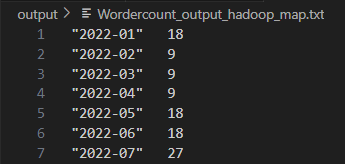

# Integration Batch Projection with DBT
The project is using VS code, Hadoop server, MapReduce (ETL), & Python to create data mart consisted of the monthly total order

# Python requirement
Python >= 3.10
Packages: see requirements.txt

# Expected Result

